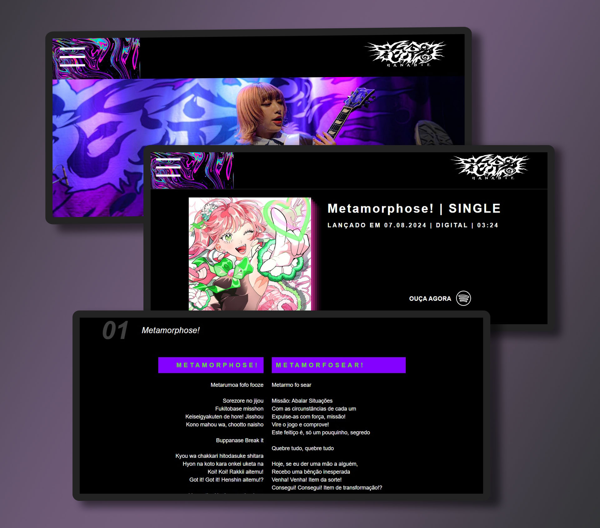

# hanabie-br

<h1 align="center"> HANABIE. BR </h1>

Fansite não oficial da banda japonesa de harajuku core.

 

  

## 🚀 Tecnologias

Esse projeto foi desenvolvido com as seguintes tecnologias:

- HTML e CSS
- JavaScript
- Git e Github
- Figma
- Photoshop

## ☝️ Desenvolvimento

Projeto de autoria própria, original em web design e desenvolvimento front-end.
Figma e Photoshop embasaram o guia visual e edições de imagem, enquanto o desenvolvimento completo do código se deu pela tríplice HTML, CSS e JavaScript. Propositalmente não foi utilizada nenhuma biblioteca ou framework, com intuito de estudar a fundo a estruturação dos sites.
Em JavaScript foi desenvolvido três funcionalidades básicas através de condicionais; enquanto a demanda recaiu, sobretudo, no CSS, para trabalhar com responsividade e keyframes. Relativamente ao HTML, este foi responsável por armazenar a letra das músicas e suas traduções, observando o correto uso de tags e seletores, deixando um código limpo e legível.

## 📱✅ Responsividade

O site possui responsividade e é possível utilizá-lo em celulares e tablets. Através do "@media screen" e dimensões estabelecidas por view height e view width ano CSS, o código pode ser livremente utilizado sem ter sua usabilidade ou visualização prejudicadas.

## 👽 Considerações da desenvolvedora

HANABIE. é uma banda japonesa de harajuku core que vem crescendo e ganhando destaque pelo mundo. Todavia, no Brasil, não vemos fansites ou fanclubes, o que restringe o contato dos fãs com as músicas e principalmente com as letras.
Pensando nisso, como forma de estudo, obtive inspirações através do site original e comecei a desenvolver a versão brasileira e aprimorada, apenas com HTML, CSS e JavaScript.
Quem analisar meu código pode se questionar: "mas por que está tudo em HTML e CSS? Não seria mais fácil utilizar um React nesse projeto?".
Sim, quem sabe eu tenha recorrido ao método mais primitivo e demorado. Mas afirmo que meu estudo gerou um projeto de alta qualidade, considerando as 5.600 linhas de código HTML. Para entender das mais diversas tecnologias, começamos da base, e que mal tem desenvolver um site com o puro e raiz front-end?